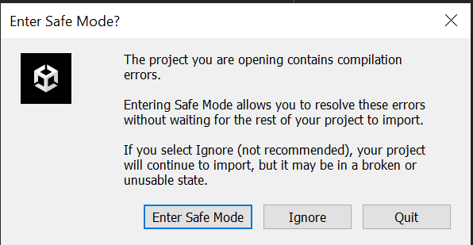
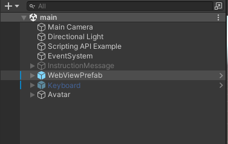
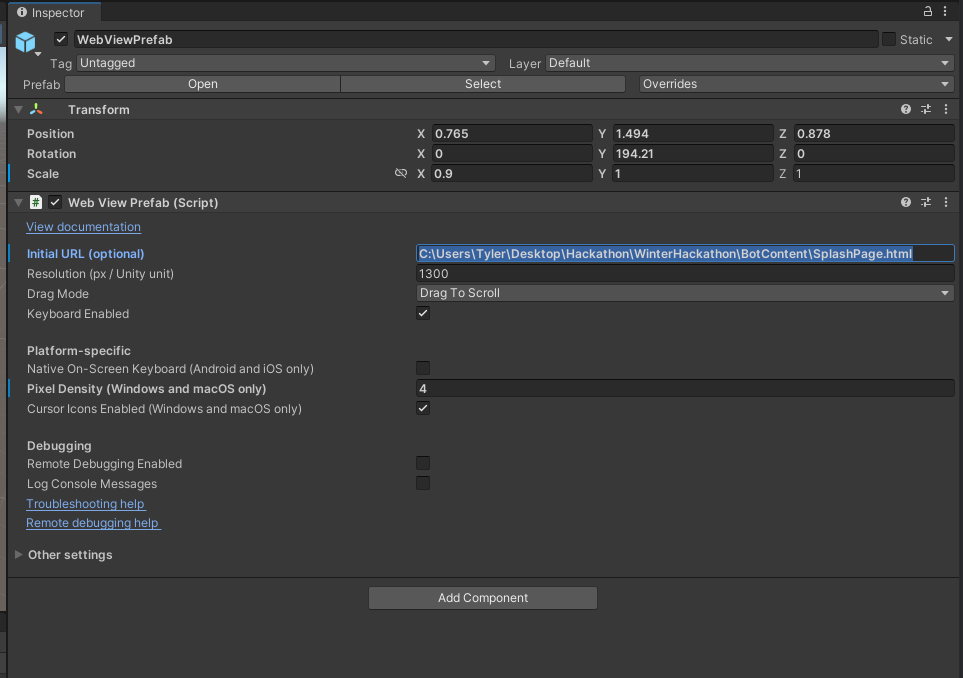
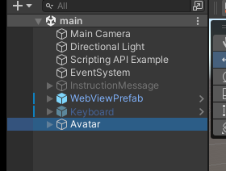
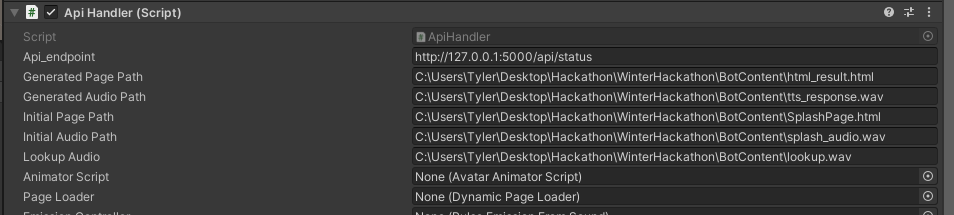

# Speak-2-Me
[](https://youtu.be/318jiesm8wo)

## Inspiration
Recent advancements in NLP and Unity make interactive avatars more accessible than ever. We believe that interactive AI that users can simply have a conversation with to answer their questions and complete their requests will be the next wave of customer service. We were inspired by videos from companies such as Nvidia showcasing the possibilities of these AI and decided to build one ourselves using the latest in NLP.

## Project Description
Our bot can answer questions about locations on Earth. Users can naturally speak their questions and requests to the bot and get answers spoken back to them. If a user asks "What is the history of Washington DC" our ai will be able to deliver a brief summary. It can also deliver images and youtube videos pertaining to the topic being discussed. The digital avatar also provides visual feedback and increases the interaction with the user, users can see the bot speaking back to them. 

The basic feedback loop is the user speaks into the microphone, the audio information is transcribed in real time using Assembly.AI technology, the text output is then run through an NLP process to extract the subject of the querry (where) and the question (what). Using those pieces of information the bot searches wikipedia, flickr and youtube for relevant information, constructs an html to present the information and then speaks the information it found online back to the user, as well as display the visual results. 

## How we built it
We started with the workflow and found technology to help accomplish our goals. Unity was chosen as the visual output layer, Python as the driving force of the backend due to the ease of use with ML technologies. The automatic speech recognition was accomplished through Assembly.AI, while the NLP was done through a combination of HuggingFace's Named Entity Recognition pipeline to detect the subject and the HuggingFace's Zero Shot Classifiers to find intent from a list of possible classes. We used several apis to gather information from various sources using the results of the NLP process, we particularly focused on using the Wikipedia api to get a text body for the ai to speak. The Text to Speech was accomplished using UberDuck's API. After the processing, the content was put into an html format, loaded and displayed into unity, where an animated avatar would speak the results of the TTS

## Run Overview
The system requires that both a python processing application (in the Python folder) be run on system as well as a Unity application which acts as the display layer. Python will do the processing and api calls while Unity renders the avatar, the applications talk to each other through a local api that will be on localhost. Future work will simplify this workflow.

In order to run the application the Python/Flask application must be run first, then the Unity front end. Note that the Python/Flask application can be left on while the Unity Front End can be restarted as needed without issue. 

## Installation Instruction
### Install Python Libraries
```
$ brew install portaudio
$ pip install -r requirements.txt
$ conda install --file conda_requirements.txt
```

### Setup Flask
Launching the Flask app requires running it as a python script and not using the flask cli. This is due to some persistency issues with a background process required by the service.
```
$ cd Python
$ python FlaskApp.py
```

### Resolve Unity Package Errors
The Unity project makes use of a paid plugin to render HTML documents in the engine. Due to the terms set in the licensing agreement we cannot redistribute the code. So the code must be imported seperatly. 
The plugin can be found here: https://assetstore.unity.com/packages/tools/gui/3d-webview-for-windows-and-macos-web-browser-154144

Using the Unity package manager, import the required assets. NOTE: When you first launch Unity you will have to do so in safe mode. 

from there you can import the package using the unity package manager and the errors will be resolved. 

### Setup Unity
In order to run the project you will also have to change a few paths within Unity. Due to the way Unity handles loading dynamic data we have to provide absolute paths, and due to time constraints we were unable to dynamically construct these at runtime so they were left as constant variables. 
Future changes to the project will resolve this issue. 

In the main.scene in Unity, select the WebViewPrefab in the Hierarchy. 



In the inspector tab, replace the "Initial URL (optional)" with the following path: <your_system_path_to_repository>\WinterHackathon\BotContent\SplashPage.html



Next select the Avatar in the hierarchy. 



Replace the "Generated Page Path", "Generated Audio Path", "Initial Page Path", and "Initial Audio Path" im a simlar manner as you did with the WebViewPrefab, directing it to the files as they appear in your system directory. 



Afterwards you may run the project in Unity to view the results, or you may choose to compile and build the project into a standalone application through the Unity Build System. We recommend for those who just wish to observe the system to run it in editor.

## Technical Links

### YouTube API
- https://medium.com/mcd-unison/youtube-data-api-v3-in-python-tutorial-with-examples-e829a25d2ebd
- https://developers.google.com/youtube/v3/getting-started
- https://www.python-engineer.com/posts/youtube-data-api-01/

### Flickr API
- https://www.flickr.com/services/api/
- https://joequery.me/code/flickr-api-image-search-python/
- https://code.google.com/archive/p/python-flickr-api/wikis/Tutorial.wiki

### Wiki API
- https://towardsdatascience.com/wikipedia-api-for-python-241cfae09f1c
- https://www.geeksforgeeks.org/wikipedia-module-in-python/
- https://www.jcchouinard.com/wikipedia-api/

### Twitter API
- https://towardsdatascience.com/an-extensive-guide-to-collecting-tweets-from-twitter-api-v2-for-academic-research-using-python-3-518fcb71df2a
- https://developer.twitter.com/en/docs/twitter-api/tools-and-libraries/v2
- https://www.jcchouinard.com/twitter-api/

### Hugging Face API
- https://huggingface.co/docs/api-inference/quicktour
- https://github.com/huggingface/hfapi
- https://huggingface.co/docs/huggingface_hub/package_reference/hf_api

### AssemblyAI API
- https://www.assemblyai.com/docs/#introduction
- https://www.assemblyai.com/docs/walkthroughs#submitting-files-for-transcription
- https://www.assemblyai.com/docs/core-transcription#automatic-punctuation-and-casing
- https://www.assemblyai.com/docs/walkthroughs#specifying-a-language
- https://www.assemblyai.com/blog/real-time-speech-recognition-with-python/

### Audio
- https://www.geeksforgeeks.org/create-a-voice-recorder-using-python/
- https://realpython.com/playing-and-recording-sound-python/
- https://python-sounddevice.readthedocs.io/en/0.3.7/

### Flask
- https://www.digitalocean.com/community/tutorials/how-to-make-a-web-application-using-flask-in-python-3#prerequisites
- https://www.tutorialspoint.com/flask/flask_application.htm
### Mixamo
Credit for the animation library and use of the X-Bot model
- https://www.mixamo.com/

## What's next for Speak-2-Me
Distributed deployment, currently the platform can only exist on a single system with no way for users to view it remotely (i.e. through a browser). 

More conversational type interaction. The interaction with our avatar is very 1 turn, user asks question, bot gives answer, with limited memory or commentary tying back to previous points in the conversation. 

Better distribution of state management and processing allocation. 

---
*Copyright (c) 2022.* [AssemblyAI Hackathon](https://hackathon.assemblyai.com/)